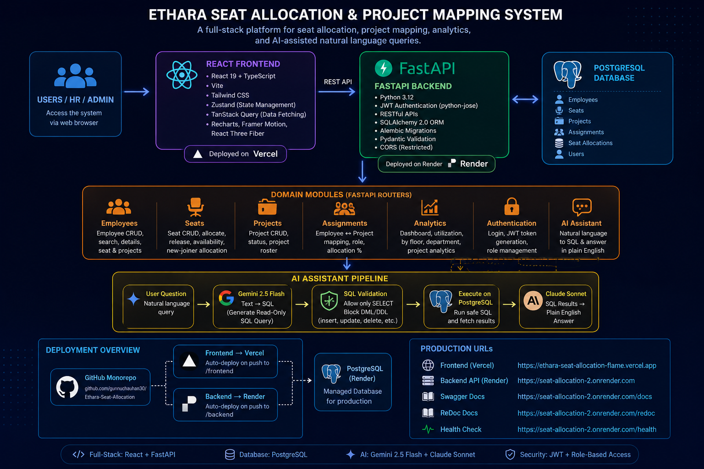
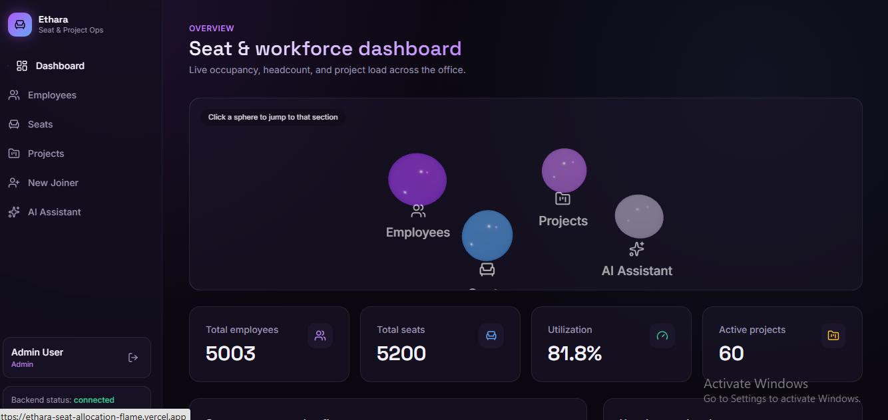
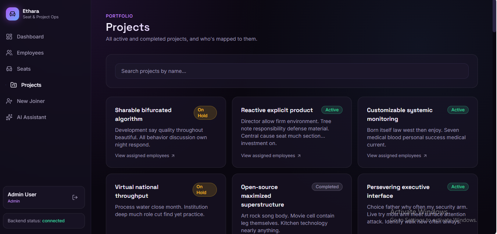
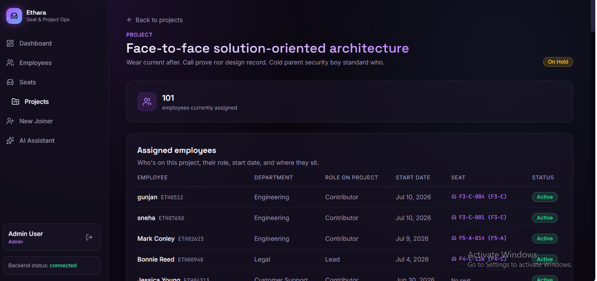
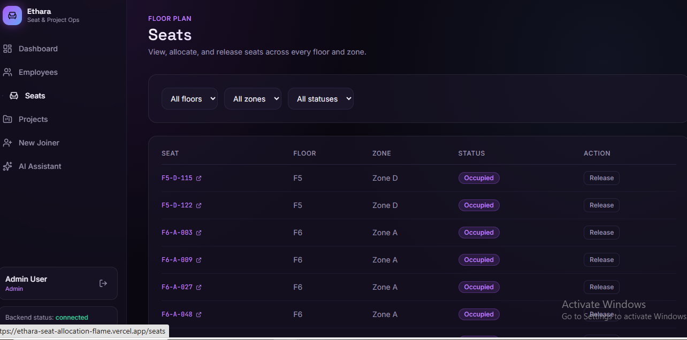
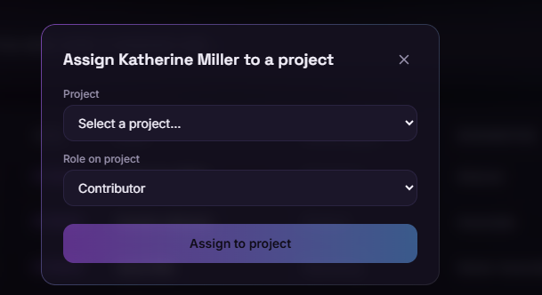
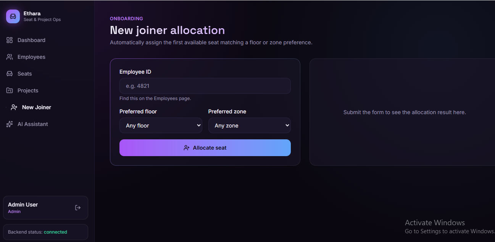
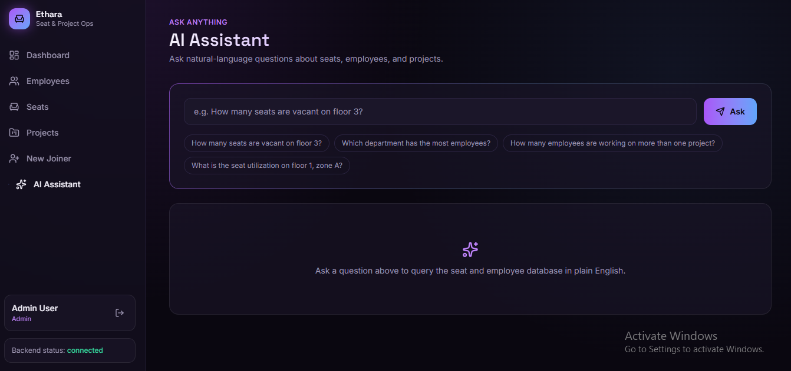

# Ethara Seat Allocation & Project Mapping System

A full-stack internal workforce operations platform for managing employee seating, project assignments, new-joiner onboarding, analytics, role-based access control, and an AI-assisted natural-language query interface — built for a ~5,000-employee organization.

**Frontend:** React 19 + TypeScript + Vite + Tailwind CSS + Zustand + TanStack Query
**Backend:** FastAPI (Python 3.12) + SQLAlchemy 2.0 + Alembic + PostgreSQL
**AI Pipeline:** Gemini 2.5 Flash (text → SQL) + Claude Sonnet (SQL results → plain English)

---

## Live Demo

| Service | URL |
|---|---|
| Live Backend (API) | [https://railway.com/project/b8ccc34a-a24e-4569-b348-4a5fcaf94bdc/service/69025406-2f4f-4a81-906b-3d3c3405b1fb/variables?environmentId=cea43e79-82c3-4062-a69c-b485e67206e3]|
| API Docs (Swagger, local) | [http://localhost:8000/docs](http://localhost:8000/docs) — after running the backend locally |
| Backend Repository | [https://github.com/HarshPawar7/Ethara-Seat-Allocation](https://github.com/HarshPawar7/Ethara-Seat-Allocation) |
| Full Project Repository (backend + frontend) | [https://github.com/HarshPawar7/Ethara-Seat-Allocation](https://github.com/HarshPawar7/Ethara-Seat-Allocation) |

> ⚠️ The backend is hosted on Render's free tier, which spins down after inactivity. The first request after idle time may take 30–60 seconds to respond while the service wakes up.

---

## Table of Contents
- [Overview](#overview)
- [Features](#features)
- [Architecture](#architecture)
- [Screenshots](#screenshots)
- [Tech Stack](#tech-stack)
- [Project Structure](#project-structure)
- [Local Setup](#local-setup)
- [Environment Variables](#environment-variables)
- [Deployment](#deployment)
- [Authentication & Roles](#authentication--roles)
- [API Endpoints](#api-endpoints)
- [Database Schema](#database-schema)
- [Business Rules](#business-rules)
- [AI Assistant Design](#ai-assistant-design)
- [Troubleshooting](#troubleshooting)
- [Known Limitations](#known-limitations)
- [Future Improvements](#future-improvements)
- [License](#license)

---

## Overview
Ethara Seat Allocation & Project Mapping System is an internal admin tool for HR, facilities, and project operations teams. It solves the everyday problem of tracking where employees sit, which projects they're assigned to, whether seats are available, and how new joiners can be allocated a desk quickly — without double-booking resources.

The system runs on a seeded, production-style dataset of approximately:

| Entity | Volume |
|---|---|
| Employees | ~5,003 |
| Seats | ~5,200 |
| Projects | ~60 |
| Seat utilization | ~82% |
| Assignments | Many-to-many (`end_date IS NULL` = active) |

---

## Features

**Employee Directory**
- Search across all employees by name, email, or employee code
- Filter by department
- Per-employee detail view: personal info, current seat, and active project list

**Seat Allocation (Floor Plan)**
- View, allocate, and release seats across every floor and zone
- Filter by floor, zone, and status (vacant / occupied / reserved)
- One active seat per employee, enforced at the data layer
- Full seat allocation history retained for audit (`released_date IS NULL` = currently occupied)

**Project Mapping**
- Project portfolio view with status (Active / On Hold / Completed)
- Per-project roster: assigned employees, role on project, start date, and current seat

**New Joiner Onboarding**
- Auto-allocates the first available seat matching a preferred floor/zone
- Falls back gracefully when no exact match is available

**Role-Based Authentication**
- JWT login for `employee`, `hr`, and `admin` roles
- Mutating actions (create/allocate/release/end) restricted to `hr`/`admin`; reads open to any logged-in role

**Dashboard & Analytics**
- Total employees, total seats, utilization %, active projects
- Seat occupancy by floor, headcount by department

**AI Assistant ("Ask Anything")**
- Ask natural-language questions like _"How many seats are vacant on floor 3?"_ or _"Which department has the most employees?"_
- Text-to-SQL generation, sandboxed to read-only queries, followed by a plain-English summary

---

## Architecture



**Flow:** Users/Admin teams → **React + Vite frontend** (deployed on Vercel) → REST API proxy → **FastAPI backend** (deployed on Render, CORS-restricted to the Vercel origin) → domain routers (Employees, Seats, Projects, Assignments, Analytics, Auth, AI Assistant) → **SQLAlchemy ORM** → **PostgreSQL** (Render-hosted).

The AI Assistant is the one path that also reaches out to external LLM APIs: the user's question goes to **Gemini 2.5 Flash** to generate a single read-only `SELECT` statement, which is validated and executed against Postgres; the resulting rows are then handed to **Claude** to produce a short, plain-English answer.

The same GitHub monorepo deploys both services independently — pushes to `/frontend` trigger a Vercel deploy, pushes to `/backend` trigger a Render deploy.

---

## 📸 Screenshots

### Dashboard


### Employees


### Employee Details


### Projects


### Project Details


### Seat Management


### Assign Project


### New Joiner


### AI Assistant


### Dashboard

Live occupancy, headcount, and project load across the office, with quick links into each section.

### Employees

Search across all 5,000+ employees by name, email, or employee code; filter by department.

### Employee Detail

Personal details, current seat, and active project assignments for a single employee.

### Seats (Floor Plan)

View, allocate, and release seats across every floor and zone.

### Projects

All active, on-hold, and completed projects with quick access to assigned employees.

### Project Detail

Full roster for a project — role, start date, seat, and status per employee.

### New Joiner Allocation

Automatically assigns the first available seat matching a floor/zone preference.

### AI Assistant

Ask natural-language questions about seats, employees, and projects in plain English.

---

## Tech Stack

| Layer | Technology |
|---|---|
| Frontend | React 19, TypeScript, Vite, Tailwind CSS |
| State / Data | Zustand, TanStack Query, Axios |
| UI / Motion | Framer Motion, Lucide React, Recharts, React Three Fiber + Drei |
| Backend | FastAPI, Python 3.12 |
| Database | PostgreSQL |
| ORM / Migrations | SQLAlchemy 2.0, Alembic |
| Validation | Pydantic |
| Auth | JWT (`python-jose`), password hashing via `passlib`/`bcrypt` |
| Seed data | Faker |
| AI Assistant | Gemini 2.5 Flash (text → SQL) + Claude Sonnet (result → plain English) |
| Backend Hosting | Render (Docker) |
| Frontend Hosting | Vercel |

---

## Project Structure
```
ethara-fullstack/
├── frontend/
│   ├── src/
│   ├── public/
│   ├── index.html
│   ├── vite.config.ts
│   ├── package.json
│   └── .env.example
├── backend/
│   ├── app/
│   │   ├── main.py                  # FastAPI app entry point, CORS, router registration
│   │   ├── core/
│   │   │   ├── database.py          # DB connection/session setup
│   │   │   └── auth.py              # JWT creation/verification, password hashing
│   │   ├── models/
│   │   │   └── models.py            # SQLAlchemy models (User, Employee, Seat, Project, Assignment, SeatAllocation)
│   │   ├── schemas/
│   │   │   └── schemas.py           # Pydantic request/response schemas
│   │   └── routers/
│   │       ├── auth.py              # /auth/login, /auth/me
│   │       ├── employees.py         # Employee CRUD + seat/projects lookup
│   │       ├── seats.py             # Seat CRUD, allocate/release, new-joiner allocation
│   │       ├── projects.py          # Project CRUD + roster
│   │       ├── assignments.py       # Employee <-> Project mapping
│   │       ├── analytics.py         # Dashboard/utilization metrics
│   │       └── ai_assistant.py      # Natural language query endpoint
│   ├── alembic/                     # DB migrations
│   ├── seed.py                      # Generates ~5,000 employees, ~5,200 seats, ~60 projects
│   ├── requirements.txt
│   ├── Dockerfile
│   ├── Procfile
│   └── .env.example
├── Images/                          # Architecture diagram + screenshots
└── README.md
```

---

## Local Setup

**Prerequisites:** Python 3.11+, Node.js 18+, PostgreSQL (or a free instance on Render/Neon/Supabase), Git.

### Backend
```bash
cd backend
python -m venv venv
source venv/bin/activate      # Windows: venv\Scripts\activate
pip install -r requirements.txt

cp .env.example .env
# edit .env: set DATABASE_URL, GEMINI_API_KEY, ANTHROPIC_API_KEY, JWT_SECRET_KEY

alembic upgrade head
python seed.py
uvicorn app.main:app --reload
```
- API: `http://localhost:8000`
- Swagger UI: `http://localhost:8000/docs`

### Frontend
```bash
cd frontend
npm install
cp .env.example .env
# edit .env: set VITE_API_URL=http://localhost:8000
npm run dev
```
- Frontend: `http://localhost:5173` (default Vite port)

---

## Environment Variables

### Backend
| Variable | Required | Description |
|---|---|---|
| `DATABASE_URL` | Yes | PostgreSQL connection string |
| `GEMINI_API_KEY` | Yes (for AI feature) | Powers text-to-SQL generation in `/ai/query` |
| `ANTHROPIC_API_KEY` | No | Powers the plain-English summary step; falls back to a deterministic formatter if unset |
| `JWT_SECRET_KEY` | Yes in production | Signs auth tokens; defaults to a dev value otherwise |

### Frontend
| Variable | Required | Description |
|---|---|---|
| `VITE_API_URL` | Yes | Base URL of the backend API (no trailing slash) |

---

## Deployment

### Backend on Render
1. Push this repo to GitHub.
2. On [render.com](https://render.com) → **New** → **Web Service** → connect the repo, set **Root Directory** to `backend`.
3. Runtime: **Docker** (uses the included `Dockerfile`).
4. Add a **PostgreSQL** instance on Render and copy its **Internal Database URL**.
5. Set environment variables on the web service:
   ```
   DATABASE_URL=<Render PostgreSQL Internal Database URL>
   GEMINI_API_KEY=<your Gemini key>
   ANTHROPIC_API_KEY=<your Anthropic key>
   JWT_SECRET_KEY=<a strong production secret>
   ```
6. **Seeding on Render's free plan:** Render Shell isn't available on free web services. Seed from your local machine using Render Postgres's **External Database URL**:
   ```bash
   $env:DATABASE_URL="PASTE_EXTERNAL_DATABASE_URL_HERE"   # PowerShell
   alembic upgrade head
   python seed.py
   ```
   ⚠️ Run the seed step only once for production/demo data.
### Frontend on Vercel
1. Import the `frontend` folder into [vercel.com](https://vercel.com) as its own project.
2. Set the environment variable:
3. Deploy  frontend: [`https://ethara-seat-allocation-flame.vercel.app`](http://localhost:5173/)

---

## Authentication & Roles
The API has role-based login (`employee`, `hr`, `admin`) via JWT.

- `POST /auth/login` — body `{"email": "...", "password": "..."}`, returns an access token + user info
- `GET /auth/me` — returns the logged-in user (send `Authorization: Bearer <token>`)
- Mutating actions (creating employees, allocating/releasing seats, new-joiner allocation, ending assignments) require `hr` or `admin`. Read-only endpoints (listing, dashboard, analytics, AI assistant) are open to any logged-in role.

> ⚠️ Set a real, random `JWT_SECRET_KEY` before any production deployment — the code falls back to a development default otherwise.

---

## API Endpoints

| Resource | Endpoints |
|---|---|
| Auth | `POST /auth/login`, `GET /auth/me` |
| Employees | `POST/GET /employees/`, `GET/PUT/DELETE /employees/{id}`, `GET /employees/{id}/seat`, `GET /employees/{id}/projects` |
| Seats | `POST/GET /seats/`, `GET /seats/available`, `GET /seats/{id}`, `GET /seats/{id}/occupant`, `POST /seats/{id}/allocate`, `POST /seats/{id}/release`, `POST /seats/new-joiner-allocate` |
| Projects | `POST/GET /projects/`, `GET/PUT/DELETE /projects/{id}`, `GET /projects/{id}/employees`, `GET /projects/{id}/assignments` |
| Assignments | `POST/GET /assignments/`, `POST /assignments/{id}/end`, `DELETE /assignments/{id}` |
| Analytics | `GET /analytics/summary`, `GET /analytics/by-floor`, `GET /analytics/by-department`, `GET /analytics/by-project` |
| AI Assistant | `POST /ai/query` — body `{"question": "..."}` |
| System | `GET /`, `GET /health` |

Full interactive documentation is auto-generated at `/docs` (Swagger) and `/redoc`, both locally and on the hosted backend.

---

## Database Schema

- **users** — `id, name, email, password_hash, role (employee/hr/admin)`
- **employees** — `id, employee_code, name, email, department, designation, joining_date, status (active/inactive)`
- **seats** — `id, seat_number, floor, zone, status (vacant/occupied/reserved)`
- **projects** — `id, name, description, status (active/completed/on_hold)`
- **assignments** — employee ↔ project mapping; `end_date IS NULL` = active
- **seat_allocations** — seat allocation history; `released_date IS NULL` = currently occupied

---

## Business Rules
- An employee can have only one active seat at a time.
- A seat can be actively allocated to only one employee.
- Offboarding/removal releases the active seat and ends active project assignments.
- Seat allocation history is retained for auditability.
- New-joiner allocation tries the preferred floor and zone first, then falls back to any available seat.
- Mutating operations (create/allocate/release/end) require `hr` or `admin` role.

---

## AI Assistant Design

The `/ai/query` endpoint uses a two-step LLM pipeline rather than a single free-form call:

1. **Text → SQL (Gemini 2.5 Flash).** The user's question, plus a fixed schema description of the five tables, is sent to Gemini with instructions to return exactly one read-only `SELECT` statement — no comments, no explanation.
2. **Safety gate.** Before execution, the backend checks the generated query starts with `SELECT` and rejects it if it contains any of `insert / update / delete / drop / alter / truncate / create / grant`. Only queries that pass are run against PostgreSQL.
3. **SQL → plain English (Claude).** The raw result rows are handed to Claude, which is asked to produce a short, direct, one-or-two-sentence answer. If `ANTHROPIC_API_KEY` isn't set, or the call fails, the backend falls back to a deterministic formatter (e.g. `"The answer is 12."` for a single count) so the user never sees raw JSON.

**Note on hardening:** a "must start with SELECT + keyword blocklist" check stops obvious write attempts but doesn't by itself prevent overly broad reads, unintended joins, or prompt-injection-driven query shaping. Worth adding for a production deployment: a table/column allowlist, a row limit on returned results, query logging for audit, and an execution timeout.

---

## Troubleshooting

**Backend connects to localhost after deploy**
- Cause: `DATABASE_URL` still points to the local dev value.
- Fix: replace with Render's PostgreSQL **Internal Database URL** in the web service's environment variables.

**CORS errors from the Vercel frontend**
- Cause: the deployed frontend origin isn't allowed by the backend's CORS config.

**Empty dashboard after deployment**
- Cause: database not seeded yet.
- Fix: run `python seed.py` once against Render's PostgreSQL database (see the seeding note under Deployment above).

**401 on protected routes**
- Cause: missing/expired `Authorization: Bearer <token>` header, or the logged-in role doesn't match the endpoint's requirement.
- Fix: re-login via `/auth/login` and confirm the role matches (`hr`/`admin` for mutating endpoints).

**AI Assistant returns a 500 "GEMINI_API_KEY not configured"**
- Cause: `GEMINI_API_KEY` missing on the backend.
- Fix: set it in the environment; `ANTHROPIC_API_KEY` is optional (a plain-English fallback formatter is used if it's absent).

**First request after idle time is very slow / times out**
- Cause: Render's free-tier web services spin down after inactivity.
- Fix: this is expected — the first request wakes the service (~30–60s); subsequent requests are fast until it idles again.

---

## Known Limitations
- No CSV import/export yet for employees or seats.
- Seat map is a structured list/grid rather than a true floor-plan drawing.
- Render's free-tier web service spins down after inactivity (cold-start delay on first request).
- `/ai/query` guardrails are currently limited to a `SELECT`-only + keyword-blocklist check (see AI Assistant Design above).
- CORS is currently permissive (`allow_origins=["*"]` in `main.py`) — tighten this to the exact frontend origin before any real production use.

---

## Future Improvements
- Table/column allowlisting and row limits for the AI assistant.
- Tighten CORS to explicit origins instead of `*`.
- Audit log/dashboard for allocation changes.
- Visual floor-plan editor for seats.
- CSV import/export for employees and seats.
- Email notifications for new-joiner allocation.

---

## License
This project is licensed under the MIT License. See `LICENSE` for details.

## Contact
Email--> iamasmodeuss@gmail.com
Github--> https://github.com/HarshPawar7
Linkedin--> https://www.linkedin.com/in/harshpawar75

## Author
Built by `<Harsh Pawar>` for the Ethara Technical Assesment.
